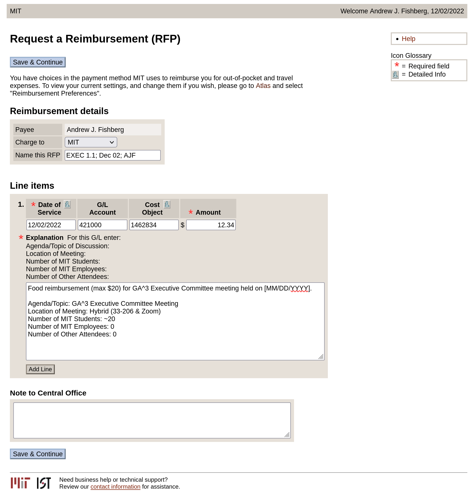

# GA^3 Meeting Food Reimbursement

* $20 max. If your receipt is for more than $20 (before tax), you may request max reimbursement.
* All purchases must be made before the meeting/event ends.

<details>
<summary>Your completed RFP should look something like this.</summary>

</details>
<br/>
<hr/>


## Name this RFP
* Template: `EXEC 1.1; [Event Date]; [Your Initials]`
* Where:
    * `[Event Date]` is the date of the event in the following form `MMM DD` (e.g. `Jan 31`)
    * `[Your Initials]` are your initials (e.g. `AJF`)
* Example: `EXEC 1.1; Jan 31; AJF`


## Date of Service
* The `Date of Service` must match the date on the receipt and be in the form `MM/DD/YYYY`.


## G/L Account
* `421000 - Food &; Beverages`
* For this type of reimbursement, always use this `G/L Account` unless otherwise instructed.


## Cost Object
* `1462834`
* For this type of reimbursement, always use this `Cost Object` unless otherwise instructed.


## Amount
* The total amount to be reimbursed, minus sales tax (if any). Do *NOT* include a `$`.


## Explanation
* Template:
```
Food reimbursement (max $20) for GA^3 Executive Committee meeting held on [Event Date].

Agenda/Topic: GA^3 Executive Committee Meeting
Location of Meeting: Hybrid (33-206 & Zoom)
Number of MIT Students: ~20
Number of MIT Employees: 0
Number of Other Attendees: 0
```
* Where:
    * `[Event Date]` is the date of the meeting in the form `MM/DD/YYYY`
