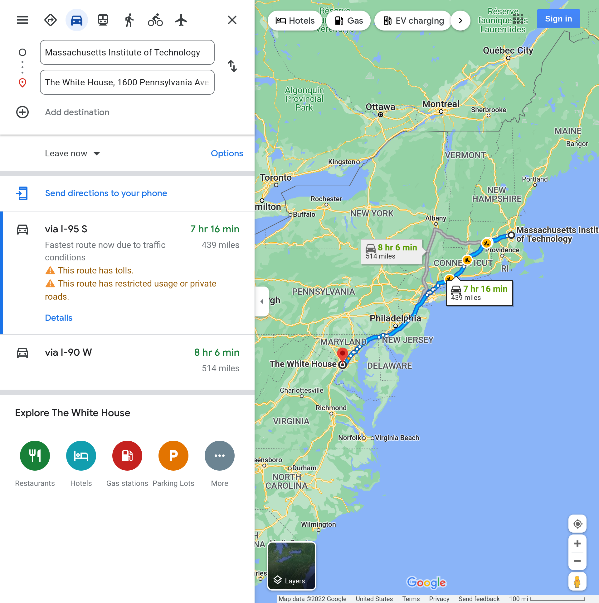

# GA^3 Mileage Reimbursement
* MIT reimburses mileage at the standard IRS Business Mileage Rate
    * 2022 rate: `58.5 cents/mile` - email [ga3-treasurer@mit.edu](mailo:ga3-treasurer@mit.edu) if this is out of date
* Do **NOT** directly upload gas station receipts. Instead, upload a screenshot of Google Maps showing the mileage from the start location to the destination.

<details>
<summary>Example Google Maps Screenshot</summary>

</details>

<details>
<summary>Your completed RFP should look something like this.</summary>

</details>
<br/>
<hr/>


## Name this RFP
* Template: `[Budget Reference]; [Event Date]; [Your Initials]`
* Where:
    * `[Budget Reference]` is from the [current semester's budget spreadsheet or Funds Viewer](./useful-links)
    * `[Event Date]` is the date of the event in the following form `MMM DD` (e.g. `Jan 31`)
    * `[Your Initials]` are your initials (e.g. `AJF`)
* Example: `SOC 1.1; Jan 31; AJF`


## Date of Service
* The `Date of Service` is the date of the drive in the form `MM/DD/YYYY`.


## G/L Account
* `420050 - Travel Expenses`
* For this type of reimbursement, always use this `G/L Account` unless otherwise instructed.


## Cost Object
* `1462834`
* For this type of reimbursement, always use this `Cost Object` unless otherwise instructed.


## Amount
* The total amount to be reimbursed, which is the total number of miles times the current IRS Standard Mileage Rate (see above for current rate). Do *NOT* include a `$`.


## Explanation
* Write a few sentences containing **all** the following material:
    * `[Reimbursement calculation]`
    * `[Drive origin]`
    * `[Drive destination]`
    * `[Total mileage]`
    * `[Number of passengers]`
    * `[Name of event drive was for]`
    * `[Date of drive]`
    * `[Location of event]`
    * `[Approximate number of attendees]`
* Example:

```
Driving 439 miles from MIT (77 Massachusetts Ave, Cambridge, MA 02139, USA) to the White House (1600 Pennsylvania Ave, NW Washington, D.C. 20500).
Car contained 3 additional passengers.

0.585 ($/mi) * 439 (mi) = $256.82

Drive was for the GA^3 DC Tour.
The event was held on 01/31/2022 in Washington DC.
There were approximately 50 attendees.
```
